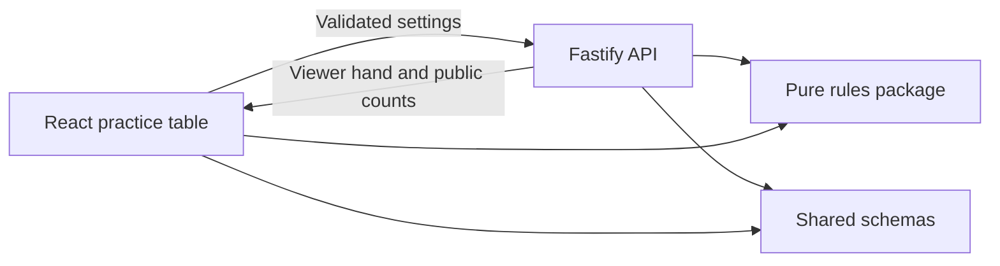

# Foundation Architecture

## Boundaries

The backend creates each practice shoe, shuffles with `crypto.randomInt`, partitions it, and returns only the viewer's hand. No full-shoe or opponent-hand endpoint exists. Practice previews are discarded after the response and are not matches. The browser's structure preview is advisory; future live commands must be validated by the server against authoritative state.

## Determinism

Physical IDs distinguish copies from separate decks. Printed rank/suit determines set identity; effective category/power determines hierarchy. Powers are consecutive within a category and are not comparable between different non-trump suits. Singles do not form tractors.

The rules package accepts shuffle choices as an injected function and has no calls to `Math.random`, cryptographic APIs, network, or wall clocks. A future event log must record shuffle inputs/results and server timer events, and include `RULES_VERSION`. Do not expose those private events to clients.

`homogeneousStructure` recognizes a single whole structure. It deliberately returns `null` for mixed selections: canonical gamble decomposition and full follow validation are separate work. `advanceLevel` applies already-awarded advancement; it does not decide Jack reset or settle a round. The score explorer assumes the advancing team starts on the displayed level; it is not live match state.

## Infrastructure

Local development uses Vite's API proxy. Container mode uses nginx with a private backend service. No websocket, database writes, or live-room authentication is present yet. The PostgreSQL Compose profile prepares a local service for later persistence work without making it a requirement for previews.

Tooling follows the official [Vite guide](https://vite.dev/guide/), [Fastify injection-testing guide](https://fastify.dev/docs/latest/Guides/Testing/), [Playwright web-server configuration](https://playwright.dev/docs/test-webserver), and [Compose application model](https://docs.docker.com/compose/intro/compose-application-model/).
