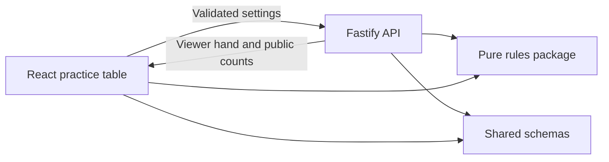

# Game Architecture

## Boundaries

The backend creates each practice shoe, shuffles with `crypto.randomInt`, partitions it, and returns only the viewer's hand. No full-shoe or opponent-hand endpoint exists. Practice previews are discarded after the response and are not matches. The browser's structure preview is advisory; future live commands must be validated by the server against authoritative state.

## Solo bot matches

`backend/src/bot-match.ts` connects declaration, kitty exchange, trick progression, and settlement. Injected time and shuffle choices make full matches reproducible in tests. Bots receive only their own hand, trump, and public lead components when choosing plays. Every bot and human move passes through `playCards`.

`bot-routes.ts` keeps sessions per application instance and projects only the human's hand, public declarations/plays/counts, and dealer-visible kitty cards. Random session IDs act as local practice tokens. Commands include a revision to reject stale or duplicate submissions. A 30-day idle expiry and 200-session cap bound storage. Human multiplayer authentication is not implemented.

`match-store.ts` writes versioned snapshots to a private directory using a synced temporary file and atomic rename before publishing the new revision in memory. Startup restores snapshots and validates their public projection. Invalid files fail startup rather than silently losing a match. One server process owns a directory; multi-process coordination and an event log remain future work. Unit tests use memory stores unless explicitly testing persistence. Docker mounts a named save volume.

The browser stores the session ID for explicit resume after refresh or server restart. It reveals server-validated bot plays sequentially and disables new commands during playback, with pause, speed, and skip controls. Reloading shows the latest saved state, not an unfinished animation. It pauses after completed tricks and settlements for review. History contains only played cards (100 recent tricks, 20 round summaries); no unplayed opponent cards or kitty contents are added. Dealing is immediate; server timestamps enforce declaration windows, and the user advances expired windows. Existing Vite/nginx proxy routes serve these endpoints without new dependencies.

## Determinism

Physical IDs distinguish copies from separate decks. Printed rank/suit determines set identity; effective category/power determines hierarchy. Powers are consecutive within a category and are not comparable between different non-trump suits. Singles do not form tractors.

The rules package accepts shuffle choices as an injected function and has no calls to `Math.random`, cryptographic APIs, network, or wall clocks. A future event log must record shuffle inputs/results and server timer events, and include `RULES_VERSION`. Do not expose those private events to clients.

`homogeneousStructure` recognizes a single whole structure. It deliberately returns `null` for mixed selections: canonical gamble decomposition and full follow validation are separate work. `advanceLevel` applies already-awarded advancement; it does not decide Jack reset or settle a round. The score explorer assumes the advancing team starts on the displayed level; it is not live match state.

## Infrastructure

Local development uses Vite's API proxy. Container mode uses nginx with a private backend service. No websocket, database writes, or live-room authentication is present yet. The PostgreSQL Compose profile prepares a local service for later persistence work without making it a requirement for previews.

### Multi-process room storage plan

The current room service runs one process per save volume and enforces ownership with a lock file. The planned PostgreSQL migration is sketched in [`infrastructure/rooms.sql`](../infrastructure/rooms.sql): `tractor_rooms` stores the authoritative payload and revisions, while `tractor_room_events` stores append-only polling events. Each command will lock the room row, verify the submitted revision, update the payload, and append its event in one transaction. `PostgresRoomStore.write` and `events` provide that atomic snapshot/event primitive. This preserves the existing optimistic-revision protocol while allowing multiple backend replicas.

Tooling follows the official [Vite guide](https://vite.dev/guide/), [Fastify injection-testing guide](https://fastify.dev/docs/latest/Guides/Testing/), [Playwright web-server configuration](https://playwright.dev/docs/test-webserver), and [Compose application model](https://docs.docker.com/compose/intro/compose-application-model/).
